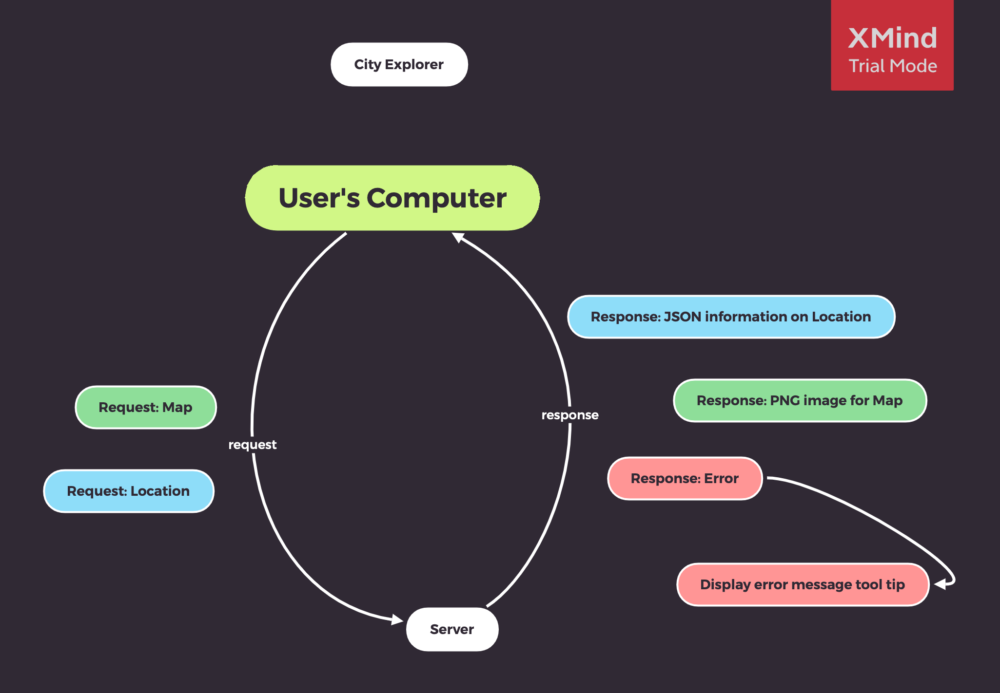

# City Explorer

**Author**: Chris Gantt
**Version**: 1.0.0

## Overview

Explore the city with this fun React App
<!-- Provide a high level overview of what this application is and why you are building it, beyond the fact that it's an assignment for this class. (i.e. What's your problem domain?) -->

## Getting Started

```bash
git clone https://github.com/ganttArt/codefellows-city-explorer.git
npm -i
'Create a .env file in your root directory. Add your locationiq api key in .env file as REACT_APP_LOCATION_KEY'
npm start
```
<!-- What are the steps that a user must take in order to build this app on their own machine and get it running? -->

## Architecture

React, Axios, React-Bootstrap, more to come...
<!-- Provide a detailed description of the application design. What technologies (languages, libraries, etc) you're using, and any other relevant design information. -->

## Change Log

<!-- Use this area to document the iterative changes made to your application as each feature is successfully implemented. Use time stamps. Here's an examples:

01-01-2001 4:59pm - Application now has a fully-functional express server, with a GET route for the location resource. -->

Name of feature: Repository and API key setup

- Estimate of time needed to complete: 30min
- Start time: 1:06pm
- Finish time: 1:39pm
- Actual time needed to complete: 33min

Name of feature: LocationIQ API request setup

- Estimate of time needed to complete: 1hr
- Start time: 2pm
- Finish time: 2:33pm
- Actual time needed to complete: 33min

Name of feature: Map

- Estimate of time needed to complete: 15min
- Start time: 2:33pm
- Finish time: 2:53pm
- Actual time needed to complete: 20min

Name of feature: Error handling

- Estimate of time needed to complete: 45min
- Start time: 4pm
- End time: 4:54pm
- Actual time needed to complete: 54min

## Credit and Collaborations

[Mason Aviles](https://www.linkedin.com/in/masonaviles/) - API Request/Response Graphic
<!-- Give credit (and a link) to other people or resources that helped you build this application. -->

## More


